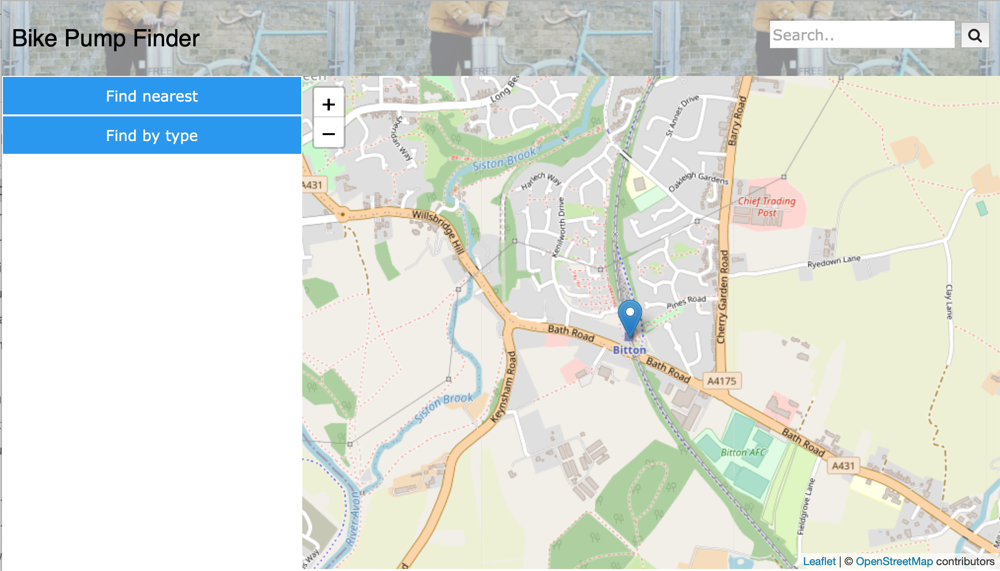

# Deployment

## Release Notes

The deployment diagram only shows 2 key nodes n the architecture which are the GitHub.io node which serves as he primary web hosting environment and the Open Data Bristol node which functions  the external data provider. the deployment UML diagram that is displayed its illustrating the architecture of the BMX-finder application. The component GitHub.io (BMX-Finder) is a component that is hosted on GitHub meaning the BMX-Finder system will be in an environment in which it is acting as the central application that handles and serves the BMX facility data to the end users. The Open Data Bristol (Public BMX Facilities) is another component but not like the previous component. This component is identified as the data provider for the BMX facilities information meaning it will be providing up to date information, how does it work ? It works by using public BMX facilities data which is in an open data format that is retrieved from Bristol’s Open data repository.  When it comes down to connections of things the BMX-Finder system retrieves data from the Open Data Bristol, this leads to the data hen being processed and later formatted before being showcased through via GitHub pages. With dependencies the existence of GitHub.io indicates how the system will be using web technologies such as the following HTML,JavaScript and finally CSS. The data integration is also going to be requiring additional JavaScript libraries or tools for the purpose of fetching and the visualisation.  Looking at the diagram we decided that there could be some known issues even though it’s not detailed enough. We collectively thought and came to an agreement that an issue can be he Open Bristol Data. This is due to the reason that we need to ensure that the Open Data Bristol remains  both accessible and reliable data source.
Describe the deployment of software components to hardware nodes using a UML Deployment diagram.

# User guide
TODO: Explain how each use-case works by providing step-by-step screenshots for each use-case. This should be based on a tested scenario.

TODO: Repeat as necessary
