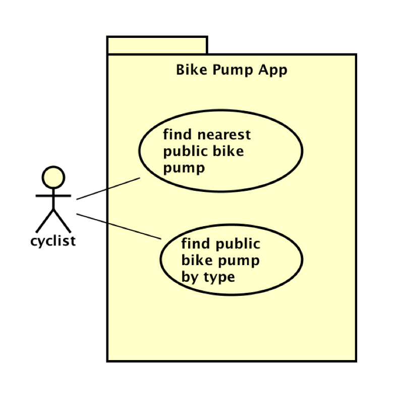

# Requirements

## User Needs

### User stories
Ayrton Merritt suggests as a BMX rider I want to find BMX Facilities nearest to me so that I do not have to travel far
Shawn Orozco suggests as a driver I want BMX riders to stay off the road so that I do not get stuck in traffic.

As a BMX rider I want to locate and find BMX facilities so that I'll be able to practice my tricks in a safe space
and ride as much as I want and not disrupt the public.

### Actors
- BMX Riders 
- Skaters
- Scooter Riders
- Members of the public 
- People who are looking for socialisation 

### Use Cases
TODO: Describe each use case (at least one per team member).
    Give each use case a unique ID, e.g. UC1, UC2, ...
    Summarise these using the use-case template below.

| TODO: USE-CASE ID e.g. UC1, UC2, ... | TODO: USE-CASE NAME | 
| -------------------------------------- | ------------------- |
| **Description** | TODO: Goal to be achieved by use case and sources for requirement |
| **Actors** | TODO: List of actors involved in use case |
| **Assumptions** | TODO: Pre/post-conditions if any</td></tr>
| **Steps** | TODO: Interactions between actors and system necessary to achieve goal |
| **Variations** | TODO: OPTIONAL - Any variations in the steps of a use case |
| **Non-functional** | TODO: OPTIONAL - List of non-functional requirements that the use case must meet. |
| **Issues** | TODO: OPTIONAL - List of issues that remain to be resolved |

TODO: Your Use-Case diagram should include all use-cases.

## Software Requirements Specification
### Functional requirements
TODO: create a list of functional requirements. 
    e.g. "The system shall ..."
    Give each functional requirement a unique ID. e.g. FR1, FR2, ...
    Indicate which UC the requirement comes from.

### Non-Functional Requirements

Give each non-functional requirement a unique ID. e.g. NFR1, NFR2, ...

Indicate which UC the requirement comes from.
